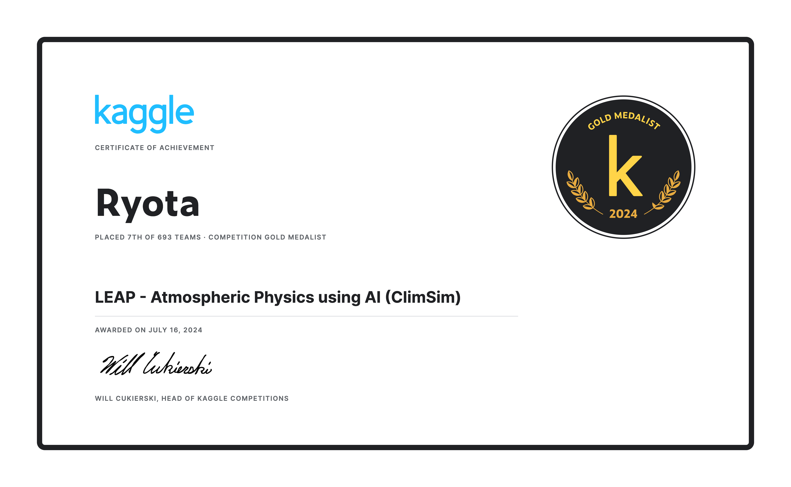

# LEAP - Atmospheric Physics using AI (ClimSim) - 7th Place Solution (Ryota Part)

This repository contains the code for the 7th place solution (Ryota Part) in the LEAP - Atmospheric Physics using AI (ClimSim) competition hosted on Kaggle. In this competition, participants were given the task of developing machine learning models that accurately emulate subgrid-scale atmospheric physics in an operational climate model, an important step in improving climate projections and reducing uncertainty surrounding future climate trends.

## Solution Summary
In my solution, I trained models based on LSTM, Transformer, and Conv1D, where each model integrates elements from the others, such as the LSTM model beginning with Conv1D layers for feature extraction. The model inputs included not only the original features but also the features generated through feature engineering that considered domain knowledge. Additionally, to address the subtle issue that, although we should optimize MSE, the influence of outliers was somewhat too strong, I first trained using MAE and then conducted additional training using MSE.

|  | Public LB | Private LB |
| --- | --- | --- |
| LSTM based | **0.78682** | **0.78120** |
| Transformer based | 0.78567 | 0.78058 |
| Conv1D based | 0.78301 | 0.77506 |

Our team's final submission consisted of an ensemble of six models, incorporating the three models described above. The ensemble weights were optimized using the Nelder-Mead method. For more details, please refer to the URL provided in the Links section.

## Preparation
You can set up the environment and download the required data by running the following commands.

### Setup
The environment is set up using [rye](https://rye.astral.sh/)
```sh
. ./bin/setup.sh
```

### Download Necessary Data
```sh
. ./bin/download.sh
```

### Download Additional Data 
The additional data is available at [LEAP/ClimSim_low-res](https://huggingface.co/datasets/LEAP/ClimSim_low-res) on Hugging Face Datasets.\
Please note that this dataset is **744GB** in size and will take a significant amount of time to download. You can still run and test the code without this additional data.
```sh
python src/data/hf_download.py
```

## Reproducing the Solution
You can train all models and make predictions for the test data by running the following command.
```sh
. ./bin/run.sh
```

## Links
- Competition website : [link](https://www.kaggle.com/c/leap-atmospheric-physics-ai-climsim)
- 7th place solution : [link](https://www.kaggle.com/competitions/leap-atmospheric-physics-ai-climsim/discussion/524111)
- My team members : [sqrt4kaido](https://www.kaggle.com/nomorevotch), [e-toppo](https://www.kaggle.com/masatomatsui), [Rheinmetall](https://www.kaggle.com/rheinmetall)
